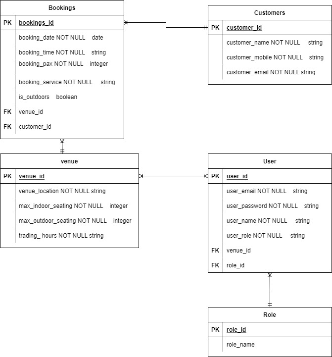

# T2A3 API Project
# Booking management system

https://github.com/R-Morton/T2A3-Restaurant-Booking-Manager-API

## Description

As the title said, this API project will be used to store booking information as well as the other relevant needs along side it such as User, venue and customer.
The hospitality industry is always in need of a functional booking management system, especially when taking in a large amount of customers in a day/night, hence why these kinds of projects are important.

The general function of this API is to be able to create user accounts, create customer records, in which bookings can be created which are related to the customer. There are also venues which bookings and staff user accounts belong to. There will be restrictions in place for staff users depending on their role, which also has its own table. Only admins and managers can make bookings for venues that they are not assigned to. Also they can only view the user accounts, for security purposed. Only Admins can create admin accounts and only admins can create new venues.

This API is completely written using ORM technique. ORM is the bridge the connects the gap to OOP languages. It is much more readable and understandable for the human eye. While you can create apps using OOP, it is much simpler to use ORM. For example, to say find one peice of data in the column of one of many tables, the code in OOP is very long. But do get the same result in ORM, its much much shorter.
ORM is great for companies as it decreases the cost of development and is easier for others to see the code and understand it themselves as there is much less code to read. Also ORM allows better security, preventing SQL injection attacks.

I have chosen PostgreSQL as my database. This is because we started using this in class and with such a big project I decided that the less unecassary problems that may come up when using a database I not used before during the development, the better for now.
There are some drawbacks to using postgresql, espcially compared to say MySQL which is a very popular database.
PostgreSQL focuses more on compatablity, so changes made to improve speed require more work.
Performance wise, MySQL is generally better, and MySQL is more supported by open source apps due to its popularity.

## Planning

Apart from my ERD which you can find further into this document, I have also used Trello to help plan and keep track of what needs to be done. As it's hard to come up with a document every single thing that needs to be done, I was able to just jumo on trello and add more that came to mind. Also great for when errors and problems arise that I need to fix further down the track, as I could just make a card for it. Below is the link for my trello board.

https://trello.com/b/22MZcu97

## Installation

Install all the requirements from the requirements.txt in the src folder using the line

```pip install requirements.txt```

Then execute this to create the tables

```flask db create```

Then seed the tables

```flask db seed```

The following third party applications are used -

### Flask
Flask is a microweb framework, commonly used in creating API's when writing in python code. That is because flask is more pythonic than Django which is a similar framework. Flask is great because it supports a lot of extensions allowing the developer to add more features in

### Flask SQLAlchemy
SQLAlchemy is an object relational mapper for use when creating SQL based apps. Flask SQLAlchemy is just the version that is more supported to work alongside Flask. When writing our ORM, SQLAlchemy reads our code and converts it into SQL language and communicates with the server, but ofcourse we still have to write the correct syntax that SQLAlchemy understands too.

### Flask Marshmallow
Marshmallow is a framework library that converts complex datatypes to and from native python types.
For example it can take tables a convert it to readable JSON format.

### Flask JWT Extended
Flask JWT extended allows the developer to implement authorization and security to an application. Its also done in a very easy and clean way compared to standard Flask JWT. A JWT Manager module is used to do all the complicated stuff, while the developer just has to write when to generate or access tokens as an example.

### psycopg2
Psycopg2 is simply an adaptor for the python language and its very popular, but it is very important as we cannot run this ORM API without it.

### Python Dotenv
Python dotenv simply reads the data in .env files which are used in the project.


## Models and relationships


### User
Starting from the user model. User_id is used as the primary key, followed by the other relevant columns.
Venue_id is a foreign key connecting the user to the venue table with a many to many relationship. While up for debate on that style, as on the surface it would seem venues can have many users and users can only belong to one venue, however if the user belongs to an admin or manager role, then they are not contrained to the functionalities of one venue like 'staff' roled users are.
role_id is a foreign key connecting the user to the role table with a one to many relationship. Roles can have many users, but users can only have one role.

### Role
Role contains role_id as the primary key but has no foreign keys as it is already linked to the User model using primary keys there.

### Booking
The bookings table uses bookings_id as its primary key and follows with the relevant other columns to hold data for this table.
venue_id is a foreign key connecting the bookings table with the venue table, giving a one to many relationship. Bookings may only belong to one venue and venues may have many bookings.
customer_id is a foreign key connecting the customers table to the bookings table, giving a one to many relationship. A Booking may only belong to one customer, but customers can have many bookings.

### Customer
The customers table uses customer_id as the primary key and follows with the relevant other columns to hold data.
The Customer table is already linked to the bookings table with foreign keys provided there.

## Venue
The venue table uses venue_id as the primary key and follows with the relevant other columns to hold data.
The venue table is already linked to the bookings table with foreign keys provided there.

## Enpoints
### User
Firstly the 'make_secure' decorator is used alongside with 'jwt_required' for added security which checks the user_id with the jwt key being used and then also reads what role is assigned to them. This decorator uses parameters, so when used, only the roles set as arguments will allow the decorator to return the route.

The 'admin_only' function is similar to the decorator just mentioned, however just being a function means I could use it within routes for particular situations.

'get_users' outputs all the users created along with their roles and the venues they belong to.

'get_user' does the same thing as 'get_users' except only returns one user based on the id given in the route, giving an error if that user does not exist.

'register_user' is the endpoint for creating a new user account. It takes the field of JSON input data and uses that information to create a new user. Error checking is involved to return error messages if data is incorrectly put in or there is a restriction, such as a non admin trying to create an admin level account. This also returns an error message if the same email address gets used, preventing duplicate accounts.

'user_login' is used the log a user in. This API uses JWT authorization, so this login is required before being able to use any other endpoint.

'user_delete' is used to delete user accounts which can only be done by admins. Using the id provided in the route, if the user can be found, it will get deleted.

### Venue

'get_venues' outputs all venues in the database and can only be viewed by admins and managers.

'get_venue' is similar but just outputs one venue by id, if that venue can be found. Once again, only for managers and admins.

'register_venue' is the route for creating a new venue, using the fields in the JSON body for each column. Error checking is used to check the location does not already exist but mostly for the trading hours to be formatted correctly, as if this is not in correctly, other endpoints will break.
Only admins can create venues.

'venue_delete' is used to delete venues by id if they exist. Once again, only admins are allowed to do this.

### Customer

'get_customers' will output all the customers in the database alongside with the bookings that belong to them.

'get_customer' will output one customer and their bookings based on the id given in the route, if they do exist.

'create_customer' is used to create a new customer which can be done by any logged in user, regardless of role. Some error checking is done on the JSON body input before saving this customer. Such as checking the mobile number is a valid length, email has an '@' and stopping duplicate customers using the mobile number.

'delete_customer' is used to delete customers by id if they exist. This can only be done by admins and managers.

### Booking

'get_bookings' will output all bookings along side with the customers and the venue they belong to.

'get_booking' will output just one booking and the venue and customer it belongs to, using the id given in the route if it exists.

'create_booking' is used to create a new booking using the JSON body for the required inputs. This one has a lot of error checking to ensure the input values are correct. It checks to ensure the venue and customer given exist. Ensures the date is not made for the past and that the booking time is also put in correctly. With the booking time it also checks what service that would belong to and saves that to the booking.

'booking_delete' is for deleting bookings using the id given in the route if it exists. This can be done by any user regardless of their role.
